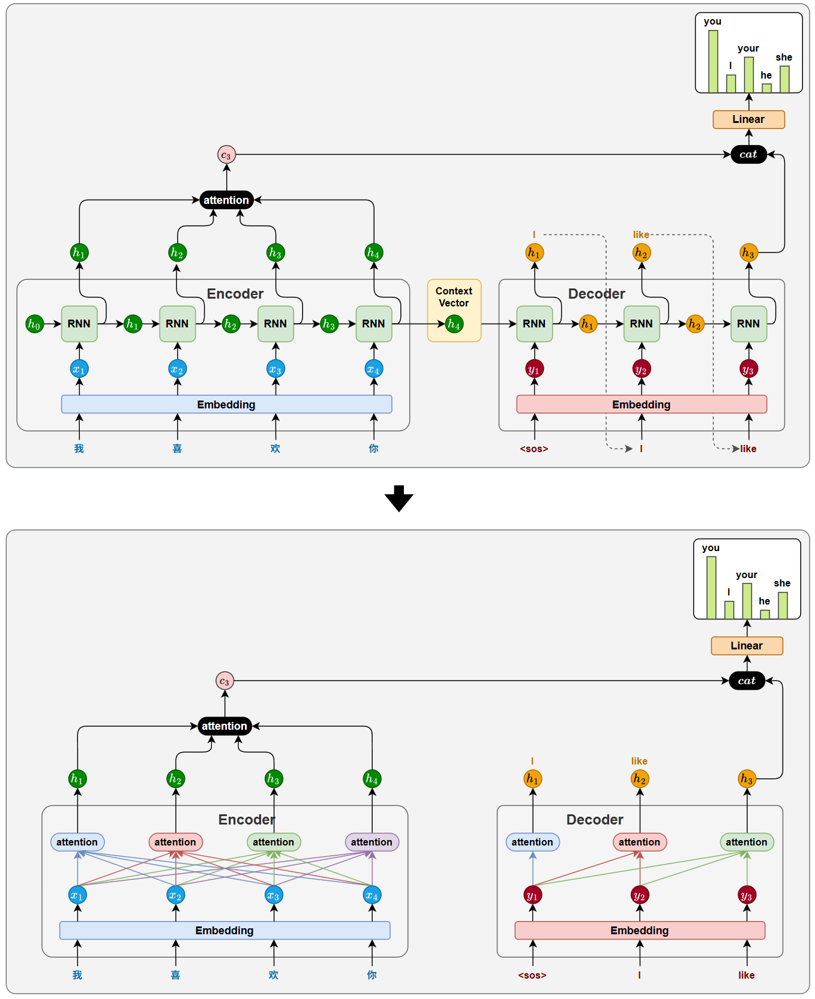

# 1 Introduction

> Recurrent neural networks, long short-term memory [13] and gated recurrent [7] neural networks in particular, have been firmly established as state of the art approaches in sequence modeling and transduction problems such as language modeling and machine translation [35, 2, 5].

**循环神经网络**，尤其是 **长短期记忆网络** [13] 和 **门控循环神经网络** [7]，已被当之无愧确立为序列建模和序列转换问题（如语言建模和机器翻译 [35, 2, 5]）中的最先进方法。

> Numerous efforts have since continued to push the boundaries of recurrent language models and encoder-decoder architectures [38, 24, 15].

此后，大量研究工作持续推进循环语言模型和编码器-解码器架构能触达到的边界 [38, 24, 15]。

> Recurrent models typically factor computation along the symbol positions of the input and output sequences.

循环模型通常沿着输入和输出序列的符号位置来分解计算。

> Aligning the positions to steps in computation time, they generate a sequence of hidden states $h_t$, as a function of the previous hidden state $h_{t-1}$ and the input for position t.

它们将位置与计算时间中的步骤对齐，生成一个隐藏状态序列 $h_t$，该序列是前一个隐藏状态 $h_{t-1}$ 与位置 t 的输入的函数。

- 

- $h_{t-1}$ 和 t 的函数：就是指一个 $h_{t-1}$ 和一个 $y_t$ 传进 RNN 单元，然后得到一个 $h_t$ 进入下一次循环。

> This inherently sequential nature precludes parallelization within training examples, which becomes critical at longer sequence lengths, as memory constraints limit batching across examples.

这种固有的顺序性阻碍了训练样本内部的并行化，这在序列长度较长时变得至关重要，因为内存限制限制了跨样本的批处理。

- 这种架构在训练的时候，就算使用 *Teacher Forcing* 的方法，有最下面一行正确前词，也没办法并行训练，因为还依赖一个前序隐藏状态 $h_t$。

> Recent work has achieved significant improvements in computational efficiency through factorization tricks [21] and conditional computation [32], while also improving model performance in case of the latter.

近期工作通过分解技巧 [21] 和条件计算 [32] 在计算效率上取得了显著提升，其中后者还同时提升了模型性能。

> The fundamental constraint of sequential computation, however, remains.

然而，顺序计算这一根本性约束依然存在。

> Attention mechanisms have become an integral part of compelling sequence modeling and transduction models in various tasks, allowing modeling of dependencies without regard to their distance in the input or output sequences [2, 19].

**注意力机制** 已成为各种任务中出色序列建模和序列转换模型不可或缺的组成部分，它允许在不考虑输入或输出序列中距离远近的情况下建模依赖关系 [2, 19]。

- 
- 传统的 encoder-decoder 架构仅依靠一个上下文向量来传递信息，太单薄了。
- 基于这个架构，引入 Attention 机制。
- 解码器在生成目标序列的每一步时，动态从编码器每个时间步的隐藏状态（绿h）提取信息，不再只依赖于一个固定的上下文变量（单一右侧黄h）

> In all but a few cases [27], however, such attention mechanisms are used in conjunction with a recurrent network.

然而，除少数情况 [27] 之外，此类注意力机制通常与循环网络结合使用。

> In this work we propose the Transformer, a model architecture eschewing recurrence and instead relying entirely on an attention mechanism to draw global dependencies between input and output.

在这项工作中，我们提出了 *Transformer*，一种摒弃循环结构、完全依靠注意力机制来建立输入与输出之间全局依赖关系的模型架构。

- 核心是要完全摒弃 RNN 架构，仅用 Attention 机制来完成。
- 

> The Transformer allows for significantly more parallelization and can reach a new state of the art in translation quality after being trained for as little as twelve hours on eight P100 GPUs.

*Transformer* 支持显著更高的并行度，并且在八块 P100 GPU 上仅训练十二小时后，就能在翻译质量上达到新的最先进水平。
