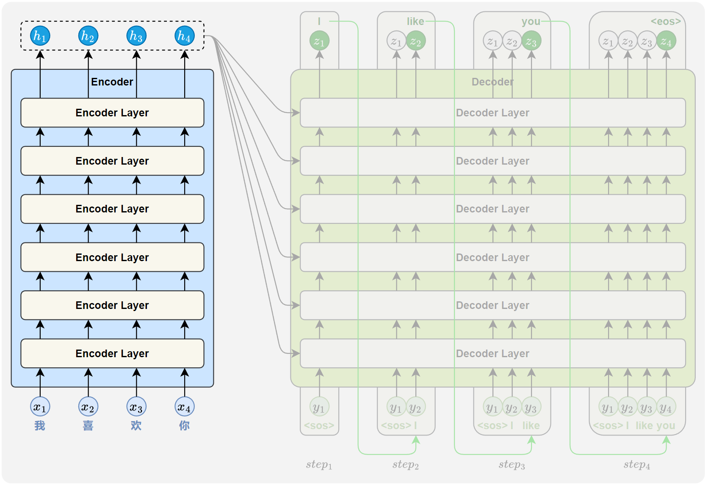
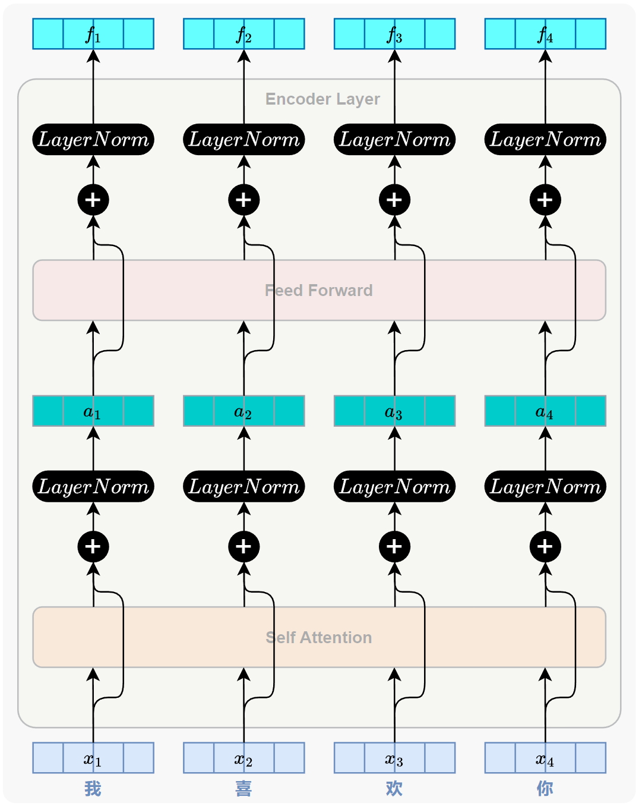
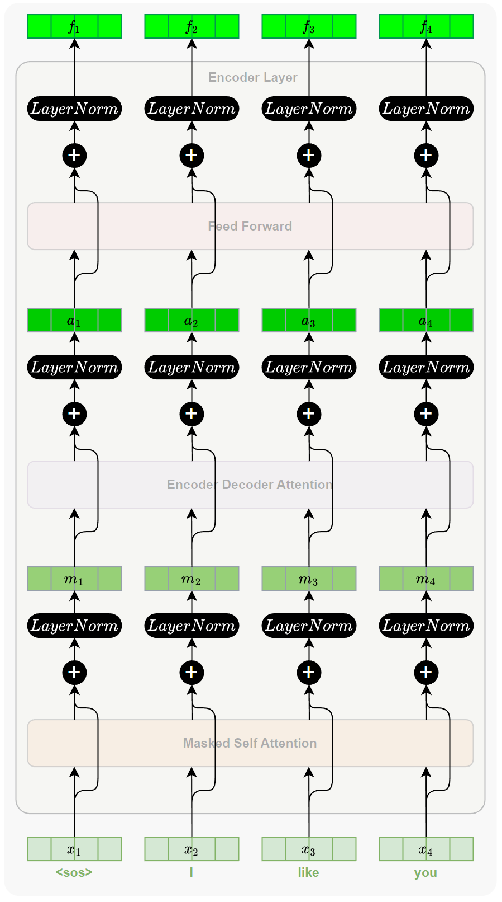

## 3.1 Encoder and Decoder Stacks

> Encoder: The encoder is composed of a stack of N = 6 identical layers.

**编码器**：编码器由 N = 6 个相同层的堆叠组成。

- 

> Each layer has two sub-layers.

每个层有两个子层。

- 

> The first is a multi-head self-attention mechanism, and the second is a simple, position-wise fully connected feed-forward network.

第一个是 **多头自注意力** 机制，第二个是简单的、逐位置的全连接 **前馈网络**。

> We employ a residual connection [11] around each of the two sub-layers, followed by layer normalization [1].

我们在两个子层周围各采用一个 **残差连接** [11]，随后进行 **层归一化** [1]。

    

> That is, the output of each sub-layer is LayerNorm(x + Sublayer(x)), where Sublayer(x) is the function implemented by the sub-layer itself.

也就是说，每个子层的输出是 `LayerNorm(x + Sublayer(x))`，其中 `Sublayer(x)` 是子层自身实现的函数。

> To facilitate these residual connections, all sub-layers in the model, as well as the embedding layers, produce outputs of dimension $d_{model} = 512$.

为了便于这些残差连接，模型中的所有子层以及嵌入层都产生维度为 $d_{model} = 512$ 的输出。

> Decoder: The decoder is also composed of a stack of N = 6 identical layers.

**解码器**：解码器同样由 N = 6 个相同层的堆叠组成。

> In addition to the two sub-layers in each encoder layer, the decoder inserts a third sub-layer, which performs multi-head attention over the output of the encoder stack.

除了和编码器一样，（有多头自注意力和前馈网络）两个子层之外，解码器还插入了第三个子层，（中间那个）该子层以编码器堆的输出为输入，然后进一步向后输出多头注意力。（可以称这个层为多头交叉注意力层）

  
  

 

> Similar to the encoder, we employ residual connections around each of the sub-layers, followed by layer normalization.

与编码器类似，我们在每个子层周围采用残差连接，随后进行层归一化。

> We also modify the self-attention sub-layer in the decoder stack to prevent positions from attending to subsequent positions.

我们还修改了解码器堆叠中的自注意力子层，以防止位置关注到后续位置。

> This masking, combined with fact that the output embeddings are offset by one position, ensures that the predictions for position i can depend only on the known outputs at positions less than i.

这种掩码，加上输出嵌入层是一个位置的偏移，确保了位置 i 的预测只能依赖于位置小于 i 的已知输出。

- 

