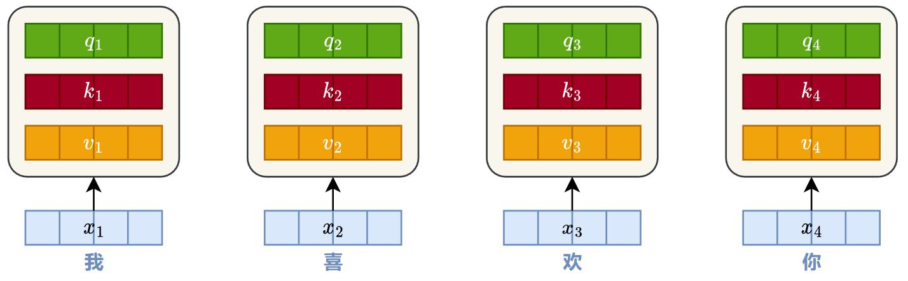
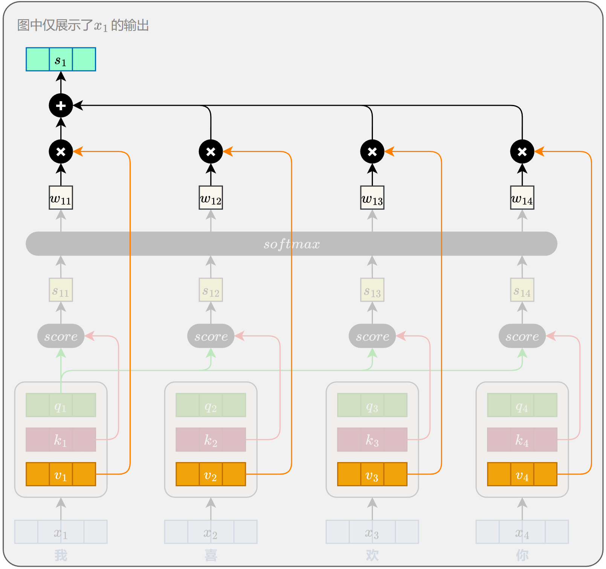
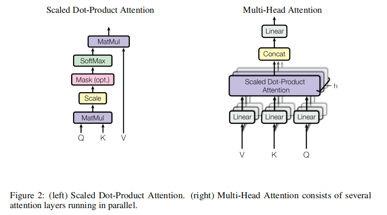
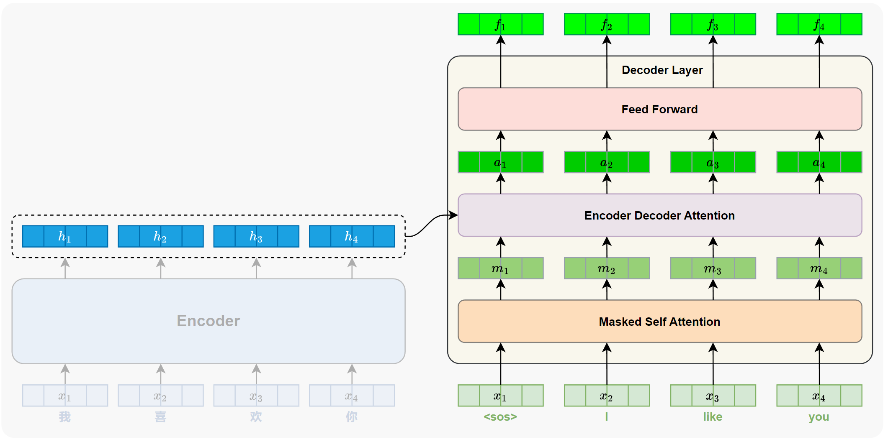
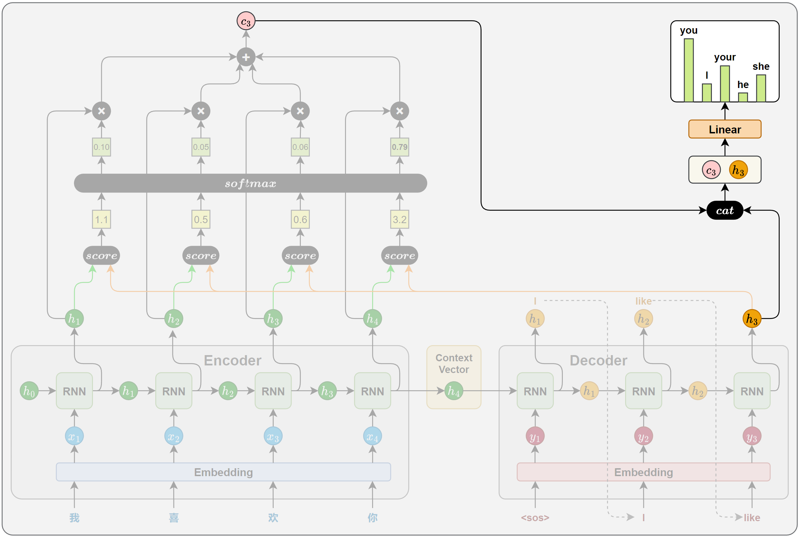
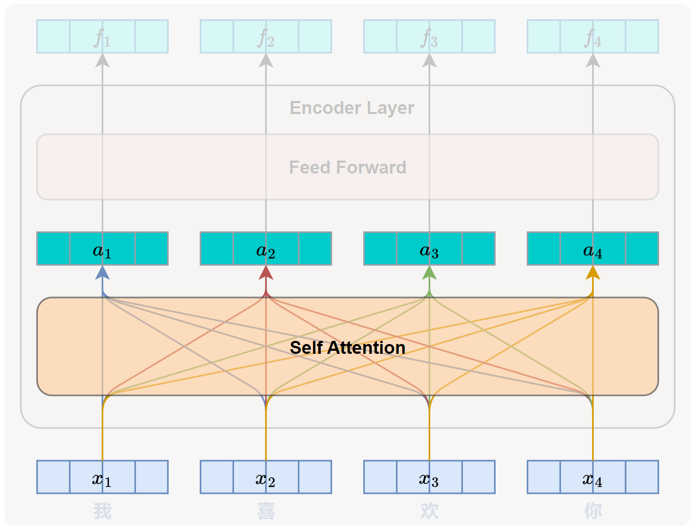
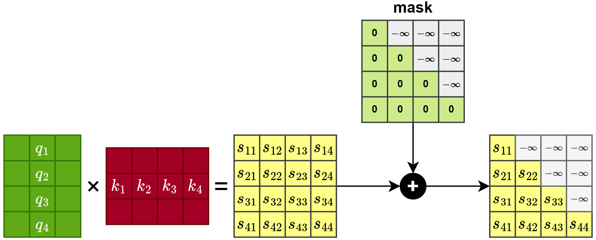

## 3.2 Attention

> An attention function can be described as mapping a query and a set of key-value pairs to an output, where the query, keys, values, and output are all vectors.

注意力函数可以描述为将一个 **Querry** 和一组 **Key-Value** 映射到一个输出，其中 querry、key、value 和输出都是向量。

    <!-- 宽度设置为 80%（可调整），上下两张图保持一样的 width 即可等宽 -->
    
    <!-- 这里 margin: 0 auto 底部没有数值，代表最后一张图下方不需要额外间距 -->
    

- 发起者为 $Q$，被查者为 $K$，计算权重时用 $W$。

> The output is computed as a weighted sum of the values, where the weight assigned to each value is computed by a compatibility function of the query with the corresponding key.

输出被计算为值的加权和，其中分配给每个值的权重由查询与相应键的兼容性函数计算得出。

### 3.2.1 Scaled Dot-Product Attention

> We call our particular attention "Scaled Dot-Product Attention" (Figure 2).

我们将这种特定的注意力称为「**缩放点积注意力**」（图 2）。

> The input consists of queries and keys of dimension $d_k$, and values of dimension $d_v$.

输入由维度为 $d_k$ 的 *Querry*、*Key*，以及维度为 $d_v$ 的 *Value* 组成。

- Q，K 维度一定一致，V 的维度一般和 Q，K 保持一致。

> We compute the dot products of the query with all keys, divide each by $\sqrt{d_k}$, and apply a softmax function to obtain the weights on the values.

我们计算查询与所有键的点积，将每个点积除以 $\sqrt{d_k}$，并应用 softmax 函数以获得值的权重。

> In practice, we compute the attention function on a set of queries simultaneously, packed together into a matrix $Q$.

在实践中，我们同时对打包成矩阵 $Q$ 的一组 *Querry* 计算注意力函数。

> The keys and values are also packed together into matrices $K$ and $V$.

键和值也被打包成矩阵 $K$ 和 $V$。

> We compute the matrix of outputs as:

我们将输出矩阵计算为：

$$
\mathrm{Attention}(Q, K, V) = \mathrm{softmax}\left(\frac{QK^T}{\sqrt{d_k}}\right)V  \qquad (1)
$$

- 

> The two most commonly used attention functions are additive attention [2], and dot-product (multiplicative) attention.

最常用的两种注意力函数是 **加性注意力** [2] 和 **点积（乘性）注意力**。

| 注意力类型 | 计算方式 | 复杂度 | 典型应用 |
|-----------|---------|--------|---------|
| 加性注意力 | $v^T \tanh(W_q q + W_k k_i)$ | $O(d_q + d_k)$ | 早期 Seq2Seq（Bahdanau等） |
| 点积注意力 | $q^T k_i$ | $O(d)$ | Transformer |
| 缩放点积注意力 | $\dfrac{q^T k_i}{\sqrt{d}}$ | $O(d)$ | Transformer（核心） |

> Dot-product attention is identical to our algorithm, except for the scaling factor of $\sqrt{d_k}$.

我们采用的是点积注意力算法，只不过（我们的算法）多了一个 $\sqrt{d_k}$ 的缩放因子。

- 发起者的 $Q$，去点乘被查询者的 $K$, $\dfrac{QK^T}{\sqrt{d_k}}$

> Additive attention computes the compatibility function using a feed-forward network with a single hidden layer.

加性注意力使用具有单个隐藏层的前馈网络来计算兼容性函数。

> While the two are similar in theoretical complexity, dot-product attention is much faster and more space-efficient in practice, since it can be implemented using highly optimized matrix multiplication code.

虽然两者在理论复杂度上相似，但点积注意力在实践中更快、更节省空间，因为它可以用高度优化的矩阵乘法代码来实现。

> While for small values of $d_k$ the two mechanisms perform similarly, additive attention outperforms dot product attention without scaling for larger values of $d_k$ [3].

虽然在 $d_k$ 值较小时两种机制表现相似，但在 $d_k$ 值较大时，加性注意力优于未缩放的点积注意力 [3]。

> We suspect that for large values of $d_k$, the dot products grow large in magnitude, pushing the softmax function into regions where it has extremely small gradients.

我们推测，对于较大的 $d_k$ 值，点积的幅度会变得很大(最大值与最小值相差巨大)，把这个作为 softmax 函数的输入效果会非常差（分类概率非 0 即 1）

> To counteract this effect, we scale the dot products by $\dfrac{1}{\sqrt{d_k}}$.

为了抵消这一影响，我们将点积缩放 $\dfrac{1}{\sqrt{d_k}}$。

> To illustrate why the dot products get large, assume that the components of $q$ and $k$ are independent random variables with mean 0 and variance 1.
> Then their dot product, $q \cdot k = \sum q_i k_i$, has mean 0 and variance $d_k$.

*（脚注 4：为说明点积为何会变大，假设 $q$ 和 $k$ 的分量是均值为 0、方差为 1 的独立随机变量。那么它们的点积 $q \cdot k = \sum q_i k_i$ 的均值为 0、方差为 $d_k$。）*

### 3.2.2 Multi-Head Attention

> Instead of performing a single attention function with dmodel-dimensional keys, values and queries, we found it beneficial to linearly project the queries, keys and values h times with different, learned linear projections to dk, dk and dv dimensions, respectively.

我们发现，与其使用 $d_model$ 维的 Key、Value 和 Querry 执行单个注意力函数，不如将 $Q$、$K$ 和 $V$ 用不同的、可学习的线性投影分别投影 $h$ 次，投影到 $d_k$、$d_k$ 和 $d_v$ 维度。

> On each of these projected versions of queries, keys and values we then perform the attention function in parallel, yielding dv-dimensional output values.

然后，我们在 Q、K 和 V 的每个投影版本上并行执行注意力函数，产生 $d_v$ 维的输出值。

> 
> These are concatenated and once again projected, resulting in the final values, as depicted in Figure 2.

这些输出值被拼接并再次投影，得到最终的值，如图 2 所示。

|  |  |
|:---:|:---:|

> Multi-head attention allows the model to jointly attend to information from different representation subspaces at different positions.

多头注意力使模型能够同时关注不同位置、不同子空间表答的信息。

> With a single attention head, averaging inhibits this.

而使用单个注意力头时，平均会抑制这种能力。

$$
\mathrm{MultiHead}(Q, K, V) = \mathrm{Concat}(\mathrm{head}_1, \dots, \mathrm{head}_h)W^O
$$

$$
\text{where } \mathrm{head}_i = \mathrm{Attention}(QW_i^Q, KW_i^K, VW_i^V)
$$

> Where the projections are parameter matrices $W_i^Q ∈ R^{d_model×d_k}$, $W_i^K ∈ R^{d_model×d_k}$, $W_i^V ∈ R^{d_model×d_v}$ and $W^O ∈ R^{h d_v×d_model}$.

其中投影是参数矩阵 $W_i^Q ∈ R^{d_model×d_k}$、$W_i^K ∈ R^{d_model×d_k}$、$W_i^V ∈ R^{d_model×d_v}$ 和 $W^O ∈ R^{h d_v×d_model}$。

> In this work we employ h = 8 parallel attention layers, or heads.

在这项工作中，我们采用 h = 8 个并行的注意力层，即「头」。

> For each of these we use dk = dv = dmodel/h = 64.

对于每个头，我们使用 $d_k = d_v = d_{model}/h = 64$。

> Due to the reduced dimension of each head, the total computational cost is similar to that of single-head attention with full dimensionality.

由于每个头的维度降低，总计算成本与具有完整维度的单头注意力相似。

### 3.2.3 Applications of Attention in our Model

> The Transformer uses multi-head attention in three different ways:

*Transformer* 以三种不同的方式使用多头注意力：

> In "encoder-decoder attention" layers, the queries come from the previous decoder layer, and the memory keys and values come from the output of the encoder.

【用法一】交叉注意力层

在「编码器-解码器注意力」层中，Q 来自上一个解码器层，而 memory 的 $K$ 和 $V$ 来自编码器的输出。

- memory 是指 encoder 流入 decoder 的那一条信息流
- 交叉注意力层，也就是第一种使用方法

    

> This allows every position in the decoder to attend over all positions in the input sequence.

这使得解码器中的每个位置都能关注输入序列中的所有位置。

> This mimics the typical encoder-decoder attention mechanisms in sequence-to-sequence models such as [38, 2, 9].

这模仿了 Seq2Seq 模型中典型的编码器-解码器注意力机制，如 [38, 2, 9]。

- 交叉注意力层，作用就是 RNN + Attention 架构中的 Attention 层。

    

> The encoder contains self-attention layers.

【用法二】编码器包含自注意力层。

> In a self-attention layer all of the keys, values and queries come from the same place, in this case, the output of the previous layer in the encoder.

在自注意力层中，所有的 K、V 和 Q 都来自同一个地方，在本例中是编码器中上一层的输出。

> Each position in the encoder can attend to all positions in the previous layer of the encoder.

编码器中的每个位置都可以关注编码器上一层中的所有位置。

    

> Similarly, self-attention layers in the decoder allow each position in the decoder to attend to all positions in the decoder up to and including that position.

【用法三：解码器多头自注意力层】

类似地，解码器中的自注意力层允许解码器中的每个位置关注解码器中直至并包括该位置的所有位置。

> We need to prevent leftward information flow in the decoder to preserve the auto-regressive property.

我们需要阻止解码器中的向左信息流，以保持自回归特性。

> We implement this inside of scaled dot-product attention by masking out (setting to −∞) all values in the input of the softmax which correspond to illegal connections.

我们通过在缩放点积注意力内部将 softmax 输入中所有对应非法连接的值掩码掉（设置为 −∞）来实现这一点。

参见图 2。

> 
> See Figure 2.

- 还是看这个图吧

    

    

