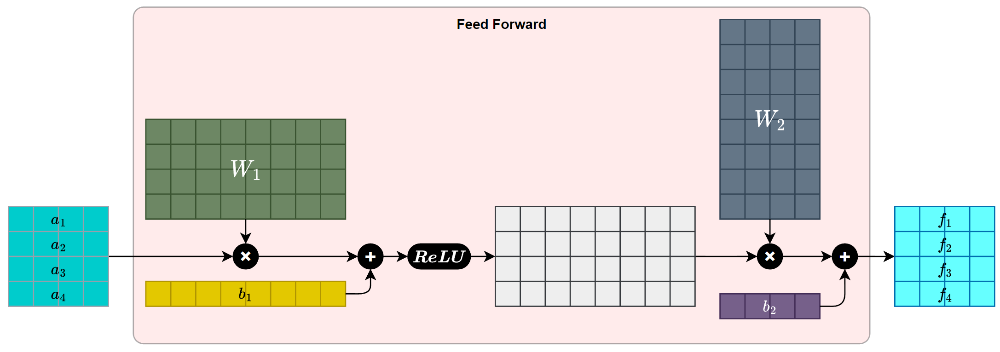

## 3.3 Position-wise Feed-Forward Networks

> In addition to attention sub-layers, each of the layers in our encoder and decoder contains a fully connected feed-forward network, which is applied to each position separately and identically.

除了注意力子层之外，我们编码器和解码器中的每一层还包含一个全连接的前馈网络，该网络被单独且相同地应用于每个位置。

    
    

- 前馈神经层是为了引入非线性，否则叠再多 en/decoder 层，都等于一次线性变换

> This consists of two linear transformations with a ReLU activation in between.

它由两个线性变换以及两者之间的一个 ReLU 激活函数组成。

$$
\mathrm{FFN}(x) = \max(0, xW_1 + b_1)W_2 + b_2 \qquad (2)
$$

> While the linear transformations are the same across different positions, they use different parameters from layer to layer.

虽然线性变换在不同位置上是相同的，但它们在层与层之间使用不同的参数。

> Another way of describing this is as two convolutions with kernel size 1.

另一种描述方式是将其视为两个卷积核大小为 1 的卷积。

> The dimensionality of input and output is dmodel = 512, and the inner-layer has dimensionality dff = 2048.

输入和输出的维度为 $d_{model} = 512$，内层的维度为 $d_{ff} = 2048$。

