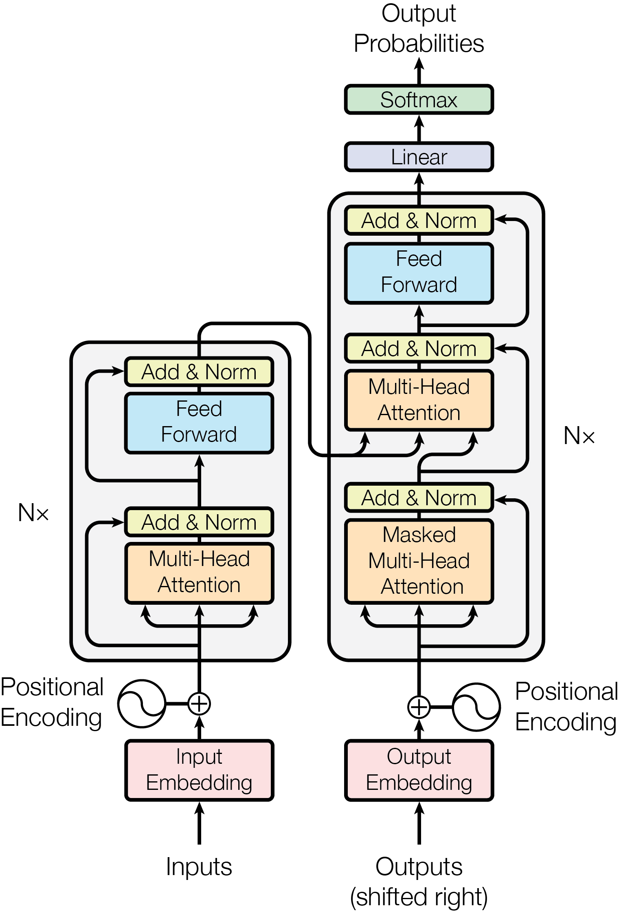
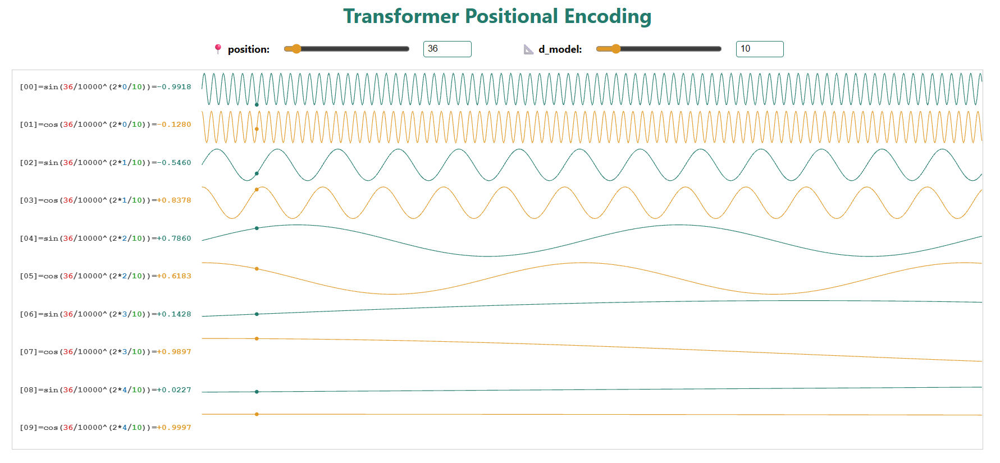

## 3.5 Positional Encoding

    

> Since our model contains no recurrence and no convolution, in order for the model to make use of the order of the sequence, we must inject some information about the relative or absolute position of the tokens in the sequence.

由于我们的模型不包含循环和卷积，为了让模型能够利用序列的顺序，我们必须向序列中词元的相对或绝对位置注入一些信息。

> To this end, we add "positional encodings" to the input embeddings at the bottoms of the encoder and decoder stacks.

为此，我们在编码器和解码器堆叠的底部向输入嵌入添加「**位置编码**」。

> The positional encodings have the same dimension dmodel as the embeddings, so that the two can be summed.

位置编码与嵌入具有相同的维度 $d_{model}$，因此两者可以相加。

> There are many choices of positional encodings, learned and fixed [9].

位置编码有多种选择，包括可学习的和固定的 [9]。

> In this work, we use sine and cosine functions of different frequencies:

在这项工作中，我们使用不同频率的正弦和余弦函数：

$$
PE_{(pos, 2i)} = \sin\left(pos/10000^{2i/d_{\text{model}}}\right)
$$

$$
PE_{(pos, 2i+1)} = \cos\left(pos/10000^{2i/d_{\text{model}}}\right)
$$

> where pos is the position and i is the dimension.

其中 pos 是位置，i 是维度。

> That is, each dimension of the positional encoding corresponds to a sinusoid.

也就是说，位置编码的每个维度对应一个正弦波。

    

> The wavelengths form a geometric progression from 2π to 10000 · 2π.

波长形成一个从 2π 到 10000 · 2π 的几何级数。

> We chose this function because we hypothesized it would allow the model to easily learn to attend by relative positions, since for any fixed offset k, PE_{pos+k} can be represented as a linear function of PE_pos.

我们选择这个函数，是因为我们假设它能让模型轻松学会通过相对位置进行关注，因为对于任何固定偏移 $k$，$PE_{pos+k}$ 都可以表示为 $PE_{pos}$ 的线性函数。

> We also experimented with using learned positional embeddings [9] instead, and found that the two versions produced nearly identical results (see Table 3 row (E)).

我们还尝试使用可学习的位置嵌入 [9] 来替代，并发现两种版本产生了几乎相同的结果（见表 3 第 (E) 行）。

> We chose the sinusoidal version because it may allow the model to extrapolate to sequence lengths longer than the ones encountered during training.

我们选择正弦版本，是因为它可能使模型能够外推到比训练中遇到的更长的序列长度。

| | N | d_model | d_ff | h | d_k | d_v | P_drop | ε_ls | train steps | PPL (dev) | BLEU (dev) | params (×10⁶) |
|---|---|---|---|---|---|---|---|---|---|---|---|---|
| base | 6 | 512 | 2048 | 8 | 64 | 64 | 0.1 | 0.1 | 100K | 4.92 | 25.8 | 65 |
| (E) | positional embedding instead of sinusoids | | | | | | | | | 4.92 | 25.7 | |

- 从评估结果来看使用正弦函数位置编码和常规位置编码几乎没有区别。
- 选择正弦版本，就是为了外推性质。遇到比训练集更长的输入，也能够正常工作